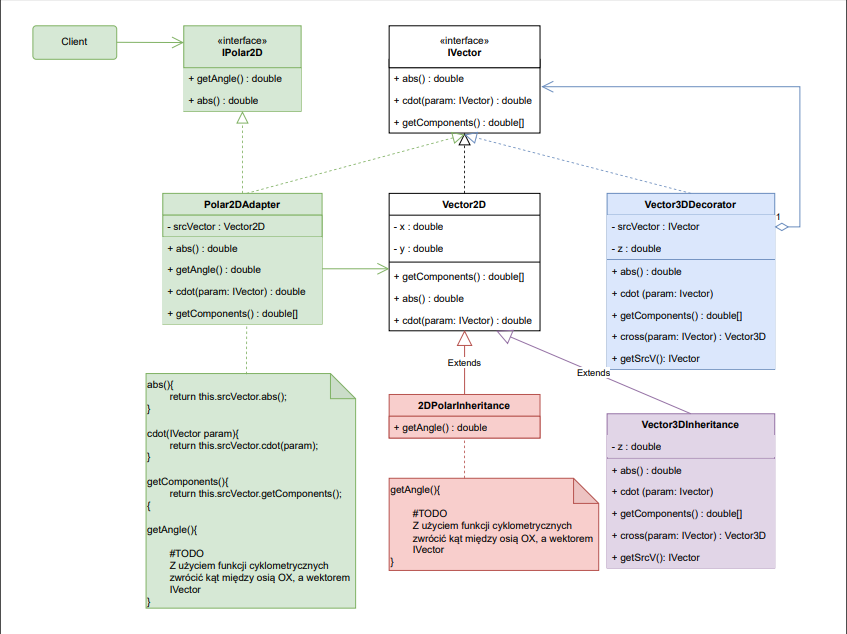

# VectorOperationsApp

A simple C# console application demonstrating 2D and 3D vector operations.  
It calculates and displays vector coordinates in both Cartesian and polar forms, and shows results of **dot** and **cross products** using the **matrix method**.

---

## Features

- Display of 2D vectors in:
  - Cartesian coordinates (x, y)
  - Polar coordinates (r, θ)
- Calculation of:
  - Dot product (scalar)
  - Cross product (as 3D with z = 0)
- Clean object-oriented design following UML diagram:

- Unit tests implemented using **NUnit 3**

## Requirements

- **.NET SDK 9.0+**  
- IDE: *JetBrains Rider* (recommended) or *Visual Studio 2022*
- **NUnit 3** and **NUnit3TestAdapter** packages installed

## Installation

Clone the repository:
```bash
git clone https://github.com/Zorquan04/vector-math-lab.git
```

Navigate to the solution directory:
```bash
cd VectorMathLabSolution
```

Restore dependencies:
```bash
dotnet restore
```

Navigate to the console app project folder:
```bash
cd VectorMathLab.App
```

And run:
```bash
dotnet run
```

You’ll see:

- vector coordinates in Cartesian and polar form

- results of dot and cross products printed in the console

Run all unit tests:
```bash
dotnet test
```

You’ll get pass/fail output for the vector operation methods.

Example Output:
```bash
=== Układ kartezjański ===
(3, 4): |v| = 5,00
(1, -2): |v| = 2,24
(-4, 1): |v| = 4,12

=== Układ biegunowy ===
(3, 4) -> r = 5,00, ? = 0,93 rad
(1, -2) -> r = 2,24, ? = -1,11 rad
(-4, 1) -> r = 4,12, ? = 2,90 rad

=== Iloczyny skalarne ===
v1v2 = -5,00
v1v3 = -8,00
v2v3 = -6,00

=== Iloczyny wektorowe (w 3D) ===
v1 x v2 = (0, 0, -10)
v1 x v3 = (0, -0, 19)
v2 x v3 = (-0, -0, -7)

=== Program zakończył działanie pomyślnie ===
```

You can freely modify the values ​​of 2D and 3D vectors in the Program.cs file, specifically:
```bash
var v1 = new Vector2D(x, y);
var v2 = new Vector2D(x, y);
var v3 = new Vector2D(x, y);
```

Oraz:
```bash
var v3D1 = new Vector3DDecorator(v1, z);
var v3D2 = new Vector3DDecorator(v2, z);
var v3D3 = new Vector3DDecorator(v3, z);
```
